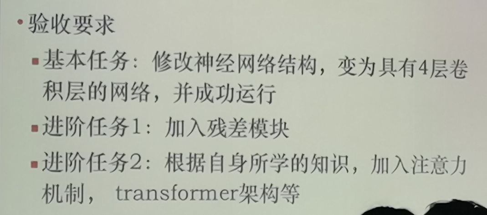

# HDU-Introduction-to-AI
杭电人工智能导论课程验收作业

## 完成一个卷积神经网络的修改
> 源代码老师已给出,制作一些修改即可,
> 导论课目的在于引导萌新入坑炼丹学

## 验收要求如下 



## Quick Start:
```python
# CNN
python CNN.py --model cnn
# Vit
python CNN.py --model vit
```

## Level1: 
+ 在`Net`类的`__init__`方法中,添加`self.conv`,保证上一层的输出维度与下一层的输入维度一致即可
+ 在`Net`类的`forward`方法中, 把`__init__`中定义的层加进去即可(保证上一层的输出维度与下一层的输入维度一致即可)
> ps: `__init__`只是做一个定义,相当于其他语言里面的成员变量,然后在`forward`可以用`self.XXXX`调用.
> `forward`在被call的时候调用,比如`output = model(x)`,其中model是一个Net的实例,x是输入的数据
```python
class Net(nn.Module):
    def __init__(self):
        super(Net, self).__init__()  # 继承nn.Module类
        self.XXXXXXXX           # 自由发挥
        
    def forward(self, x):
        x = self.XXXXXXXX(x)
        return x
        
```

## Level2:
+ Kaiming大神的residual connection思想简单,就是类似于电路的"短路"
+ 短路的方式大抵有两种:
1. 直接相加
```python
    def forward(self, x):
        x = self.conv1(x)
        x = self.conv2(x)
        x0 = x
        x = self.conv3(x)
        x = self.conv4(x)
        x = x + x0  # residual connection 1
        return x
```
2. 维度堆叠(concat)
```python
        x = torch.concat([x, x0], 1)  # residual connection 2  # 两个[bs, 32, 7, 7]的tensor堆叠起来(dim=1),维度为[bs, 64, 7, 7]
        x = self.conv(x)  # [bs, 64, 7, 7] -> [bs, 32, 7, 7]  # 这里要变回去
        x = x.view(x.size(0), -1)  # 展平多维的卷积图成 (batch_size, 32 * 7 * 7)
        output = self.out(x)
        return output
```


## Level3:
+ Vit(Vision Transformer)
+ 把原本用在NLP的Transformer用到了CV上, 引入Attention机制

**大概流程:**
1. `patch_embedding`: input: `[bs, in_channels, h, w]` -> output: `[bs, embed_dim, num_patches_in_h, num_patches_in_w]` 其实就是做了一个 `kernel` 和 `strip` 为 `patch_size` 的 `conv`
2. `flatten`: input: `[bs, embed_dim, num_patches_in_h, num_patches_in_w]` -> output: `[bs, embed_dim, num_patches_in_h * num_patches_in_w]`
3. `transpose`: input: `[bs, embed_dim, num_patches_in_h * num_patches_in_w]` -> output: `[bs, num_patches_in_h * num_patches_in_w, embed_dim]`
   (是不是非常像NLP里面的`[bs, seq_len, embed_dim]`了呢?恍然大悟.jpg)
4. add `cls_tokens`(做一个dim=1的concat): input: `[bs, num_patches_in_h * num_patches_in_w, embed_dim]` -> output: `[bs, num_patches_in_h * num_patches_in_w + 1, embed_dim]`
   (相当于给每句话加上了一个`<cls>`, 目的是作为一个**更加公平的分类token**)
5. `position_embedding`: 维度不变, 只是给一个相同的tensor和前面相加,这里区别于 `position_encoding`(它是不可学习的,具体可见《Attention is all you need》)

这时候已经变成NLP里面的形式了,后面就正常当NLP处理即可
6. `Encoder`: 里面有`depth`层`EncoderLayer`
7. `EncoderLayer`: 里面是`MultiheadAttention`和`FeedForward`
8. `MultiheadAttention`: 里面有`num_heads`个`Attention`
9. `Attention`: 里面有`Q`, `K`, `V`, 按照公式来就行了, `QK'`乘一乘, 接softmax, 除以`sqrt(dim)`, 乘一乘`V`,最后维度变回来了,所以随便叠
10. 关于`norm`选择: 都是用`nn.LayerNorm`, 因为对一句话而言, 它的特征是"一句话相关的", 和batch中其他样本的特征基本上没关系,因为他们是不相关的两句话

> 试了一下, Vit在MNIST上效果还不如CNN 🤡, 收敛太慢了, 可能是position_embedding的位置信息太弱了, 而且需要学习, 
> 但CNN与生俱来的位置信息提取的优越性足够解决这个简单问题, Vit在这里更像是大炮打蚊子了